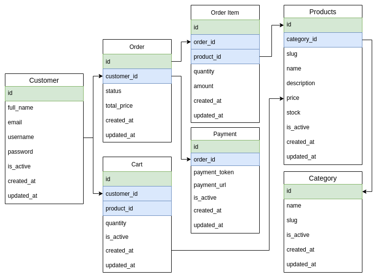

# GO Mini Ecommerce ✨

### Entity Relationship Diagram

### Technologies - Libraries
* [gofiber/fiber](https://github.com/gofiber/fiber) - Web Framework
* [spf13/viper](https://github.com/spf13/viper) - Config Reader
* [ozzo-validation](https://github.com/go-ozzo/ozzo-validation) - Go Struct and Field validation
* [swaggo/swag](https://github.com/swaggo/swag) - Swagger documentation
* [golang-jwt/jwt](github.com/golang-jwt/jwt) - JSON Web Token
* [midtrans/midtrans-go](https://github.com/Midtrans/midtrans-go) - Payment Gateway
* [go-gorm/gorm](https://github.com/go-gorm/gorm) -  ORM
* [MySQL](https://www.mysql.org) - MySQL Database
* [redis/go-redis](https://redis.com) - Redis

This app required 2 database connection
```
# run postgreSQL
docker run -d -p 3306:3306 mysql -e MYSQL_ROOT_PASSWORD=masukdb -e MYSQL_DATABASE=go_mini_ecommerce

# run redis
docker run -d -p 6379:6379 redis --requirepass "masukredis"
```
### Runing App
1. Copy config.example.yaml to config.yaml and fill the config
```azure
App:
    Name:
    Version:
    Port: :
    Environment:
    Timeout:

Mysql:
    Host:
    Port:
    User:
    Password:
    DbName:
    MaxIdleConnection:
    MaxOpenConnection:

Redis:
    Host:
    Port:
    Password:

Jwt:
    SecretKey:

Midtrans:
    ServerKey:
```
2. Runing app docker-compose.yaml
```
$ docker docker-compose up -d --build
```
- After run this, don't forget to check all container are successfully started

### Swagger Docs
```
http://localhost:4545/swagger/index.html
```
